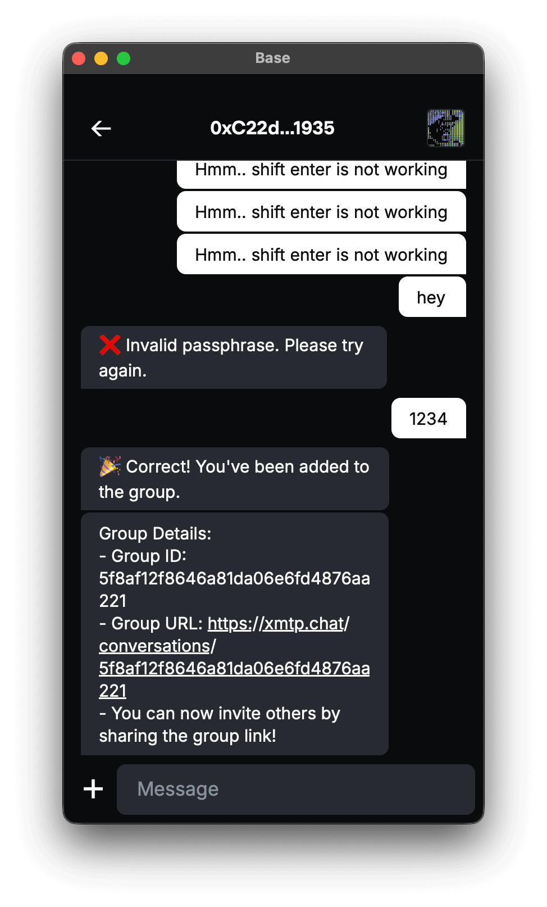
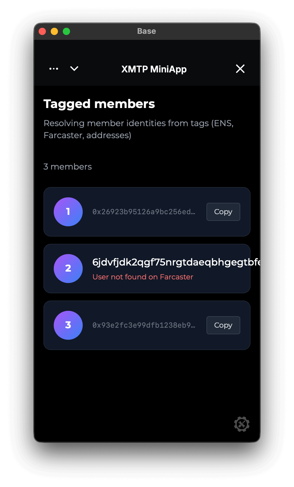

# Mini-app standalone example

This combines a backend agent and a frontend mini app to resolve mentions in a group chat.

<p align="center" >
  
  
</p>

## Usage

1. Send a message in a group chat to the agent tagging other users.

```bash
hey @game, lets challenge @vitalik.eth @humanagent.eth and @0x...
```

2. The agent will respond with a mini app link to the frontend.

```bash
🚀 View in Mini App:
http://localhost:3000?tags=vitalik.eth,humanagent.eth,0x...
```

3. The frontend will resolve the mentions and display the user profiles.

```bash
✅ vitalik.eth → 0x...
✅ humanagent.eth → 0x...
✅ 0x... → 0x...
```


### Requirements

- Node.js v20 or higher
- Yarn v4 or higher
- Docker (optional, for local network)

### Environment variables

To run your XMTP agent, you must create a `.env` file with the following variables:

```bash
XMTP_WALLET_KEY= # the private key of the wallet
XMTP_DB_ENCRYPTION_KEY= # encryption key for the local database
XMTP_ENV=dev # local, dev, production
```

### Run the agent

```bash
# git clone repo
git clone https://github.com/ephemeraHQ/xmtp-mini-app-example mini-app-example
# go to the folder
cd mini-app-example  
cd backend
# install packages
yarn
# run the agent
yarn start
```


### Run the frontend

```bash
# git clone repo
git clone https://github.com/ephemeraHQ/xmtp-mini-app-example mini-app-example
# go to the folder
cd mini-app-example  
cd frontend
# install packages
yarn
# run the frontend
yarn dev
```